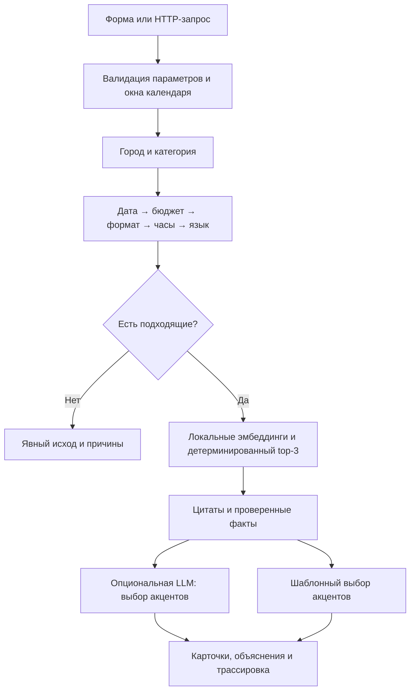

# NeuroForge

**Объяснимый подбор подрядчиков для мероприятий в Казахстане.**

NeuroForge помогает организатору выбрать до трёх подрядчиков из существующего
каталога. Сервис проверяет доступность на дату, бюджет и условия мероприятия,
учитывает пожелания и объясняет каждую рекомендацию конкретными сведениями
из профиля.

Проект команды **NeuroForge** для **HackAlem AI**, кейс **«Креативные индустрии» —
«Умный подбор подрядчиков» (#79-lite)**.

[Запуск](#быстрый-запуск) · [Проверка для жюри](#проверка-для-жюри) ·
[Архитектура](#как-работает-решение) · [API](#api) ·
[Сценарий защиты](docs/demo.md)

## Какую проблему решаем

В каталоге подрядчиков заказчику приходится вручную сравнивать цены, форматы,
языки и описания, а затем выяснять, кто свободен на нужную дату.
NeuroForge сокращает этот процесс до одного запроса и короткого списка с
обоснованиями. Подходит организаторам корпоративов, свадеб, конференций и
других мероприятий, а также площадкам-агрегаторам подрядчиков.

Пользователь задаёт **город, дату, тип мероприятия, категорию и бюджет**.
При желании добавляет длительность, язык и свободное описание пожеланий.
Результат — карточки подходящих кандидатов либо понятное объяснение,
почему выбрать сейчас не из кого.

## Что реализовано

- **Подбор до трёх кандидатов** из каталога с детерминированным порядком.
- **Проверка занятости** для подрядчиков и площадок по одному календарному правилу.
- **Фильтры** по бюджету, формату, языку и допустимой длительности.
- **Семантическое сравнение** пожеланий с описаниями через локальную мультиязычную модель.
- **Конкретные объяснения:** цитата из профиля, начальная цена и проверенные условия.
- **Три явных исхода:** нашли варианты, категории нет в городе, кандидаты есть, но не подходят.
- **Честная неполная выдача:** если подходит один или два профиля, сервис объясняет причину.
- **Веб-интерфейс и HTTP API**, пять готовых демонстрационных запросов.
- **Трассировка подбора:** сколько профилей осталось после каждого фильтра.
- **Опциональная внешняя LLM:** выбор дополнительных акцентов с проверкой ответа, кэшем и fallback.
- **Пометки происхождения данных:** синтетические профили и проставленные при подготовке цены/города.

## Быстрый запуск

Основной сценарий работает **без API-ключей, платных сервисов и GPU**.
Node.js и сборка frontend не нужны.

Нужны Git, Python 3.13 и интернет для первой установки зависимостей и загрузки
модели. Проект проверен в чистом окружении на macOS. Для Linux/Windows в
lock-файле предусмотрен CPU-вариант PyTorch; отдельная проверка Windows
не проводилась.

```bash
git clone https://github.com/BAITC-Hacks/hack-22572782-neuroforge.git
cd hack-22572782-neuroforge
python -m pip install uv==0.11.7
uv run --frozen --extra dev python run.py
```

Откройте **http://127.0.0.1:8000**. Интерактивная документация API:
**http://127.0.0.1:8000/docs**.

Если команда `python` отсутствует, для установки uv используйте `python3`
на macOS/Linux или `py -3.13` на Windows. Если uv не появился в PATH,
команды доступны как `python -m uv ...`.
Если системный Python запрещает установку через pip, установите uv по
[официальной инструкции](https://docs.astral.sh/uv/getting-started/installation/).
Файл `.python-version` указывает Python 3.13; uv может загрузить этот интерпретатор.

При первом запуске дождитесь строки `Application startup complete`.
В проверке с пустым кэшем загрузка модели и прогрев заняли **146,7 секунды**;
скорость зависит от сети. После установки пакетов и скачивания модели основной
сценарий работает локально.

Если порт занят:

```bash
uv run --frozen python run.py --port 8001
```

Публичная развёрнутая версия пока не предоставлена. Адрес `127.0.0.1`
доступен на той машине, где запущен сервис.

## Проверка для жюри

Одна команда запускает **75 автономных тестов и пять демо-сценариев на настоящей
модели эмбеддингов**. Она не обращается к платным LLM API и возвращает ненулевой
код при провале проверки.

```bash
uv run --frozen --extra dev python run.py --check
```

Те же сценарии доступны кнопками в интерфейсе:

| Что проверить | Запрос | Ожидаемый результат |
|---|---|---|
| Плотная категория | Алматы, ведущий, корпоратив, 13.10.2026, 2 млн ₸ | Три карточки из восьми подходящих |
| Влияние даты | Тот же запрос на 31.12.2026 | Другие кандидаты, два варианта, объяснение занятости |
| Редкая категория | Алматы, флорист, свадьба, 07.11.2026, 600 тыс. ₸ | Один вариант с объяснением, почему не три |
| Никто не подходит | Алматы, банкетный зал, корпоратив, 31.12.2026, 200 тыс. ₸ | Кандидаты есть, но заняты или дороже бюджета |
| Нет категории | Астана, декоратор, корпоратив, 14.11.2026, 1 млн ₸ | Такой категории в этом городе нет |

Повторите первый запрос: **порядок карточек останется прежним**.
Раскройте «Как получился этот список»: видны этапы фильтрации, баллы и источник
выбора фактов для объяснений. Ожидания в таблице относятся к исходным 66 профилям
и текущей конфигурации.

Подтверждённые результаты:

- Чистая копия проекта без `.env`, новое окружение и пустой кэш модели прошли проверку.
- Все **75 тестов** и **пять сценариев** завершились успешно.
- В дополнительном прогоне **448 комбинаций** не найдено нарушений фильтров
  или одинаковых объяснений внутри одной выдачи.
- После прогрева запросы с брифом занимали **0,367–0,483 с** в чистом окружении
  без внешней LLM. Это локальный замер, а не гарантия для любого сервера.

[Подробные результаты и ограничения проверки](docs/validation.md) ·
[Показ проекта за три минуты](docs/demo.md)

## Как работает решение



**Фильтрация.** Город и категория формируют пул. Каждый следующий фильтр
сужает его. Для исключённого кандидата сохраняется первая причина отсева,
поэтому счётчики не дублируются. Площадки проходят ту же проверку даты, что и люди.

**Ранжирование.** При наличии брифа локальные эмбеддинги сравнивают пожелания с
описаниями. Дополнительные признаки учитывают запас бюджета, часов и
поддерживаемые языки. Неприменимые признаки исключаются, веса перенормируются.
Баллы округляются перед сортировкой; равенство разрешается по ID.
LLM не участвует в выборе кандидатов и их порядке.

**Объяснения.** Из каждого профиля извлекается цитата, по возможности отличающая
его от соседних карточек. Без брифа цитата тоже присутствует. Цена и условия
берутся из структурированных данных. Если подключена LLM, она выбирает один-два
идентификатора из разрешённого меню фактов. Ответ проверяется как JSON;
произвольный текст модели в карточку не попадает.

При ошибке API, невалидном ответе или превышении времени используются те же
проверенные факты в штатном порядке. В трассировке различаются LLM, кэш и fallback.

[Подробная архитектура и формула скоринга](docs/architecture.md)

## Технологии

| Компонент | Реализация |
|---|---|
| Язык и API | Python, FastAPI, Pydantic, Uvicorn |
| Интерфейс | HTML, CSS, JavaScript без сборки |
| Семантика | sentence-transformers, `paraphrase-multilingual-mpnet-base-v2` |
| Вычисления | NumPy, PyTorch |
| Внешние LLM | OpenAI-совместимый клиент; OpenAI и NVIDIA NIM |
| Данные | JSONL в репозитории, каталог в памяти |
| Кэш | NPZ для эмбеддингов, SQLite для проверенного выбора фактов |
| Проверки и зависимости | pytest, HTTPX, uv и `uv.lock` |

В разработке использовались AI-агенты **Codex и Claude Code**.

## Подключение OpenAI и NVIDIA

Создайте локальный `.env` по образцу [`.env.example`](.env.example) и заполните
ключ нужного провайдера:

```dotenv
OPENAI_API_KEY=ваш_ключ
NVIDIA_API_KEY=ваш_ключ
```

Включите внешние вызовы явно:

```bash
uv run --frozen python run.py --llm
```

Без `--llm` стартовый скрипт отключает внешние API даже при наличии ключей.
С `--llm` сначала используется OpenAI, затем NVIDIA при отказе первого провайдера.
По умолчанию один вызов ограничен 4 секундами, общее ожидание объяснений — 5 секундами.
Три карточки обрабатываются параллельно; проверенный выбор фактов кэшируется.

Одиночная проверка провайдера без кэша:

```bash
uv run --frozen python scripts/check_live_llm.py --provider openai
uv run --frozen python scripts/check_live_llm.py --provider nvidia
```

Эти команды отправляют демо-данные внешним сервисам и могут расходовать API-кредиты.
Ключи нельзя коммитить; `.env` и рабочие кэши исключены из Git.

**Статус интеграций:** одиночный живой запрос к OpenAI `gpt-4o` проверен;
валидный ответ получен за 1,939 с. NVIDIA при проверке отклонил авторизацию
текущим ключом. Полный прогон всех сценариев с внешними LLM пока не подтверждён.
Основной автономный сценарий от этого не зависит.

## API

| Метод | Путь | Назначение |
|---|---|---|
| GET | `/` | Интерфейс |
| GET | `/health` | Готовность сервиса и режим объяснений |
| GET | `/catalog` | Справочники и границы календаря |
| GET | `/demo-scenarios` | Готовые запросы |
| POST | `/recommend` | Подбор подрядчиков |

Пример тела `POST /recommend`:

```json
{
  "city": "Алматы",
  "date": "2026-10-13",
  "event_type": "корпоратив",
  "category": "Ведущий",
  "budget_kzt": 2000000,
  "brief": "Интеллигентный ведущий для делового вечера"
}
```

Обязательны первые пять полей; `brief`, `language` и `duration_h` опциональны.
Проверить запрос без написания кода можно через `/docs`.

| Поле ответа | Значение |
|---|---|
| `outcome` | `FOUND`, `NO_CATEGORY` или `NO_MATCH` |
| `cards` | До трёх карточек с объяснениями и пометками происхождения |
| `message` | Причины пустой/неполной выдачи и контекст занятости |
| `pool_size` | Число профилей в городе и категории |
| `eligible_count` | Число всех прошедших фильтры |
| `found_count` | Число показанных карточек |
| `trace` | Счётчики фильтров, признаки рейтинга и источники объяснений |

Бизнес-исходы возвращаются с HTTP 200. Некорректные параметры и дата вне
подтверждённого календаря дают HTTP 422 с объяснением.

## Данные и границы MVP

Источник — [датасет организаторов](data/raw/hackathon-dataset-anonymized.jsonl):
**66 анонимизированных профилей**, включая **13 синтетических**, уже присутствующих
в поставке. Синтетические профили, а также проставленные при подготовке города
и цены отмечаются в интерфейсе.

- Календарь покрывает **23.09–31.12.2026**. За пределами окна доступность неизвестна,
  поэтому такие запросы отклоняются.
- Цена «от» — нижняя граница, а не подтверждённая смета.
- Цитаты отражают сведения профиля; независимая проверка опыта не выполнялась.
- Без брифа семантический признак отключён. Если также не заданы язык и часы,
  ранжирование опирается на запас бюджета и ID.
- Одинаковые исходные сведения не превращаются в вымышленные преимущества:
  при совпадающих объяснениях сервис сообщает об этом.
- Бронирования, оплаты, уведомлений подрядчикам и автоматической смены условий нет.

Дополнительные профили можно положить в `data/synthetic/extra_profiles.jsonl`
с `synthetic: true`. Уникальность ID проверяется при загрузке.
При замене календарного покрытия измените `NEUROFORGE_CALENDAR_START` и
`NEUROFORGE_CALENDAR_END`. Остальные настройки описаны в [`.env.example`](.env.example).

## Структура репозитория

```text
api/                   HTTP API и жизненный цикл сервиса
src/neuroforge/         фильтры, скоринг, объяснения, LLM и загрузка данных
ui/                    интерфейс без сборки
data/raw/              исходный каталог
data/demo_queries.json пять демонстрационных запросов
scripts/               подготовка модели и проверки
tests/                 автономные тесты и регрессии
docs/                  архитектура, результаты проверок, сценарий защиты
run.py                 запуск сервиса или полной проверки
pyproject.toml          зависимости и настройки проекта
uv.lock                зафиксированные версии и хэши
```

В [.github/workflows/checks.yml](.github/workflows/checks.yml) настроены проверки
Linux. Первый запуск GitHub Actions не дошёл до тестов: GitHub сообщил о блокировке
аккаунта из-за billing. Локальная проверка в чистом окружении прошла; Windows
и визуальная проверка браузера отдельно не подтверждены.

Для сдачи: отправить актуальный код в репозиторий команды и нажать
**«Сдать решение»** на платформе хакатона. Готовое описание проекта и план
показа находятся в [docs/demo.md](docs/demo.md).
